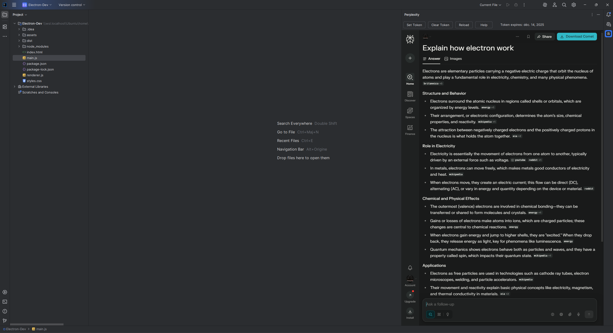

# Perplexity Integration for IntelliJ IDEA

Integrate Perplexity AI chat directly into your IntelliJ IDEA. Get instant access to AI-powered conversations, research, and assistance without leaving your code editor.

*Screenshot: Perplexity running inside IntelliJ IDEA*

## ✨ Features

- 🚀 **Seamless Integration** - Perplexity AI embedded directly in your IDE
- 🔐 **Flexible Authentication** - Login via browser or session token
- 🔄 **Session Management** - Save and manage authentication tokens
- 📊 **Token Expiration Tracking** - Visual display of token validity
- ⚡ **Quick Access** - Always available in the right sidebar
- 
## 📦 Installation

### Via JetBrains Marketplace

1. Open IntelliJ IDEA
2. Go to **Settings/Preferences** → **Plugins**
3. Click on **Marketplace** tab
4. Search for **"Perplexity Integration"**
5. Click **Install** and restart IDE

### Manual Installation

1. Download the latest release from [Releases](https://github.com/Pralexio/PerplexityIntegration/releases)
2. Open IntelliJ IDEA → **Settings/Preferences** → **Plugins**
3. Click ⚙️ → **Install Plugin from Disk**
4. Select the downloaded `.jar` file
5. Restart IDE

## 🚀 Quick Start

1. **Open the plugin**
    - Click on the **Perplexity** tab in the right sidebar
    - Or use **View → Tool Windows → Perplexity**

2. **Login (Choose one method)**

   **Method 1: Direct Login (Recommended)**
    - Click login button directly in the embedded browser
    - Use Google, Apple, or Email to sign in

   **Method 2: Session Token (Fallback)**
    - If you have login issues, click **"Set Token"** in the toolbar
    - Follow the **Help** guide to extract your token from Chrome/Firefox
    - Token lasts ~30 days

3. **Start using Perplexity**
    - Ask questions, research topics, get code help
    - All within your IDE!

## 🛠️ Toolbar Features

| Button | Description |
|--------|-------------|
| **Set Token** | Manually set your Perplexity session token |
| **Clear Token** | Remove saved token and logout |
| **Reload** | Refresh the Perplexity page |
| **Help** | Detailed authentication instructions |
| *Token Status* | Shows token expiration date |

## ⚙️ Requirements

- IntelliJ IDEA 2023.1 or later
- JCEF (Java Chromium Embedded Framework) support
- Internet connection

## 🤝 Contributing

Contributions are welcome! Please feel free to submit a Pull Request.

1. Fork the repository
2. Create your feature branch (`git checkout -b feature/AmazingFeature`)
3. Commit your changes (`git commit -m 'Add some AmazingFeature'`)
4. Push to the branch (`git push origin feature/AmazingFeature`)
5. Open a Pull Request

## 🐛 Reporting Issues

Found a bug or have a feature request? [Open an issue](https://github.com/yourusername/perplexity-integration/issues/new)

Please include:
- IntelliJ IDEA version
- Plugin version
- Steps to reproduce
- Expected vs actual behavior

## 🏗️ Development

### Prerequisites
- JDK 17 or later
- Gradle 8.0+

### Build & Run
Run plugin in development IDE
./gradlew runIde

Build plugin JAR
./gradlew buildPlugin

Run tests
./gradlew test

## 📝 Changelog

See [CHANGELOG.md](CHANGELOG.md) for version history and updates.

### Latest Release (v1.5)
- ✨ Token-based authentication system
- 📊 Token expiration tracking
- 📖 Enhanced help with Chrome/Firefox guides
- 🎨 Improved UI with toolbar
- 🔄 Better page reload mechanism

## 📄 License

This project is licensed under the Apache License 2.0 - see the [LICENSE](LICENSE) file for details.

## 🙏 Acknowledgments

- [Perplexity AI](https://www.perplexity.ai) for the amazing AI platform
- JetBrains for the IntelliJ Platform SDK
- All contributors who help improve this plugin

## 📧 Support

- **Issues:** [GitHub Issues](https://github.com/Pralexio/PerplexityIntegration/issues)
---

Made with ❤️ by [pralexio](https://github.com/pralexio)
with [TickrateFrance](https://tickrate.fr)

⭐ Star this repo if you find it useful!
